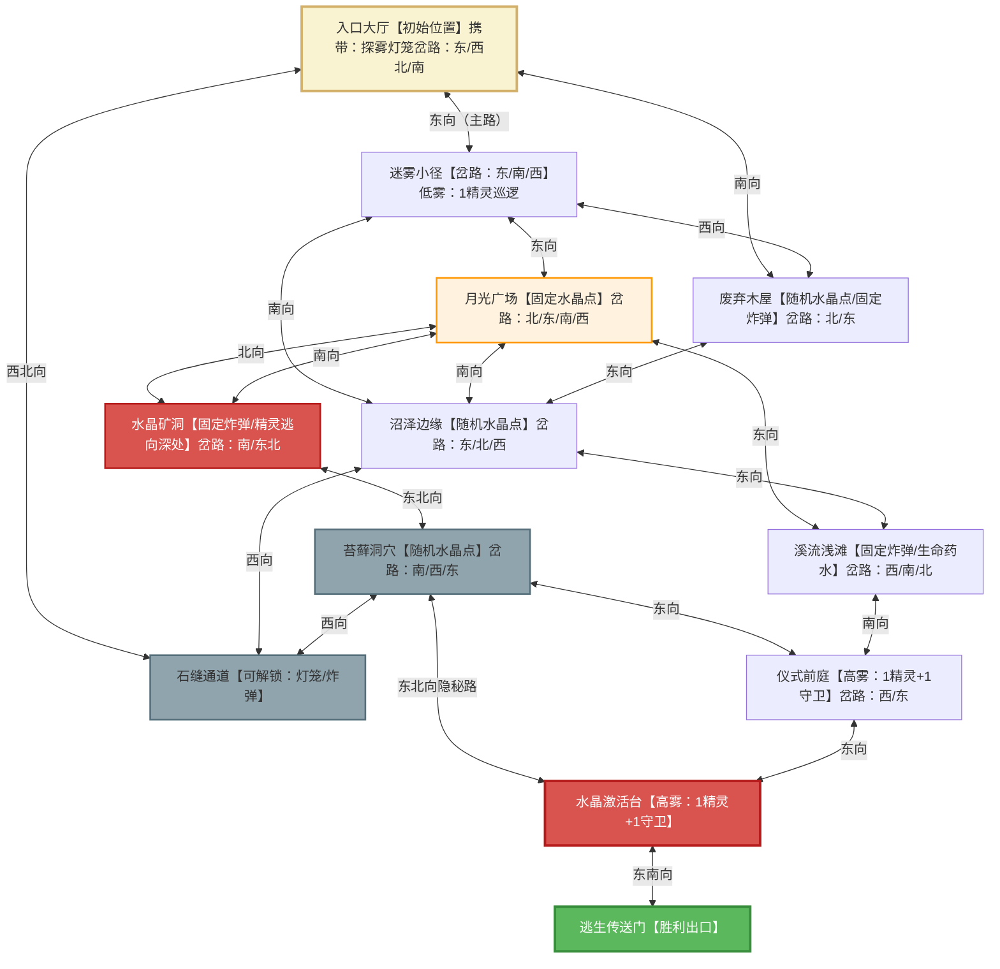

# 《迷雾森林：月光水晶》

## 一、游戏背景与核心设定

玩家因意外闯入被古老魔法迷雾笼罩的森林，唯有收集3颗散落的“月光水晶”并在“水晶激活台”触发驱散仪式，才能找到逃生传送门。森林中不仅有“迷雾精灵”（随迷雾浓度调整策略），还遗留着前人的“迷雾炸弹”，玩家可拾取用于攻击或突破；高雾阶段精灵会召唤“迷雾守卫”，玩家需结合探索、收集、战斗完成任务。  

## 二、核心机制与状态系统

### 1. 迷雾浓度动态系统

- **低雾（游戏前5分钟）**：视野清晰，精灵行动敏捷。  

- **中雾（游戏5-10分钟）**：视野部分遮挡，精灵开始伏击。  

- **高雾（游戏10分钟后/玩家收集2颗水晶）**：视野严重受限，精灵全力封锁激活台。  

- 实现方式：Prolog动态事实`fog_density(低/中/高)`，通过`fog_timer/0`谓词每5分钟自动升级浓度，玩家收集水晶也会触发浓度检测。  

### 2. 玩家状态

- 生命值：初始100，被精灵攻击或触发陷阱会减少，可通过道具恢复。  

- 物品栏：最多携带6件道具，通过`has_item/1`动态管理。  

- 已收集水晶数：`collected_crystals(0-3)`，影响精灵目标。  

- 高雾暴露时间：`time_in_fog(0秒)`，高雾状态下持续累积，超过180秒触发失败（见失败条件）。  

### 3. 精灵状态

- 行为模式：随迷雾浓度和玩家进度从“主动搜索”→“伏击”→“封锁”动态演变。  

- 协作机制：高雾状态下可召唤“迷雾守卫”（额外对手）形成协作封锁。  

- **抢夺机制**：攻击玩家时，若玩家`health < 30`（虚弱状态），50%概率触发`steal_action`，抢走1颗水晶并向“水晶矿洞深处”逃窜（移动速度临时+20%）。  

- 高亮标记：携带水晶的精灵会被`marked_enemy`标记，玩家可追踪。  

## 三、胜负条件

### 1. 胜利条件

- **主线胜利**：`collected_crystals(3), activated_ritual, escaped(传送门)`即收集3颗水晶→激活驱散仪式→找到并通过逃生传送门。  

### 2. 失败条件

- **生命耗尽**：`health(0)`（无论是否持有生命药水，生命值归0即失败）。  

- **任务道具死局**：`map_crystals(剩余可获取数) + collected_crystals(玩家持有数) < 3`（水晶被精灵成功带离地图，导致无法收集3颗）。  

- **迷失心智**：`fog_density(高), time_in_fog > 180s`（高雾状态下持续暴露180秒以上，逼迫玩家速战速决）。  

## 四、辅助道具系统

|道具名称|获取途径|效果与技术实现|策略价值|
|---|---|---|---|
|月光水晶|月光广场（固定1颗）、随机刷新2颗（从沼泽边缘、苔藓洞穴、废弃木屋中选2个）|收集后`collected_crystals(N+1)`；单颗使用：移动速度+20%（持续30秒）|胜利核心资源，随机分布提升探索性|
|探雾灯笼|初始自带|`visibility(玩家, 高, 2格)`，可解锁石缝通道|核心探索道具，扩大视野+解锁隐藏路|
|生命药水|溪流浅滩药草（3分钟冷却采集）|`health(100)`|生存保障，恢复生命值（冷却缩短至3分钟，适配15-20分钟战局）|
|迷雾粉尘|水晶矿洞宝箱（随机刷新，上限2个）|`fog_density(目标区域, 高, 20秒)`，精灵`visibility(低)`|反制道具，创造逃生/收集窗口|
|迷雾炸弹|水晶矿洞深处宝箱（固定1个）、废弃木屋角落（固定1个）、溪流浅滩宝箱（固定1个）|一次性使用：`attack_damage(40)`，对范围内对手造成伤害；同时触发`fog_density(区域, 高, 15秒)`；可暴力炸开石缝通道（替代灯笼）|核心攻击武器，多区域分布适配不同战斗场景，新增通道解锁功能防止卡关|
## 五、核心属性

### 1. 物品属性表

|物品ID|物品名称|类型|获取途径|基础效果|进阶效果（与机制联动）|堆叠数量|冷却时间|使用条件|
|---|---|---|---|---|---|---|---|---|
|IT001|月光水晶|核心资源|月光广场（固定1颗）、随机2颗（沼泽边缘/苔藓洞穴/废弃木屋选2）|收集后水晶数+1|单颗使用：移动速度+20%（30秒）；3颗组合：激活驱散仪式|3（上限）|无|位于刷新点且未被精灵抢夺|
|IT002|探雾灯笼|环境适配|初始自带|自身周围2格视野→清晰|解锁石缝通道；标记路径（marked_path/1，300秒）|1（唯一）|无（永久使用）|背包持有且未损坏|
|IT003|生命药水|生存保障|溪流浅滩药草（3分钟冷却）|生命值恢复至100|无额外联动|2（上限）|180秒（原300秒缩短，适配战局时长）|生命值＜100且背包持有|
|IT004|迷雾粉尘|对抗反制|水晶矿洞宝箱（随机刷新）|目标区域迷雾浓度→高（20秒）|精灵视野-50%，封锁动作（block）失效|2（上限）|无|背包持有|
|IT005|迷雾炸弹|攻击武器|水晶矿洞深处（固定1）、废弃木屋角落（固定1）、溪流浅滩宝箱（固定1）|一次性造成40点伤害，范围1格|爆炸后区域迷雾升高15秒，对手视野-60%；可炸开石缝通道（替代灯笼，防止卡关）|3（上限）|无|与对手同区域/需解锁通道时|
### 2. 玩家（人物）属性表

|属性分类|属性名称|初始值|动态变化规则|上限/下限|关联道具/机制|失败触发阈值|
|---|---|---|---|---|---|---|
|基础信息|玩家ID|PL001|固定不变|唯一|无|无|
||角色名称|寻宝者|可自定义（代码中用变量接收）|无|无|无|
||初始位置|入口大厅|通过move/1动作更新|迷宫所有可达区域（支持双向通行，便于周旋）|移动动作|无|
|状态属性|生命值|100|被精灵攻击-20/次；被守卫攻击-15/次；生命药水+100|0（下限）-100（上限）|生命药水、对手攻击|0（直接触发失败）|
||已收集水晶数|0|收集水晶+1；被精灵抢夺-1|0-3|月光水晶、精灵steal_crystal动作|无（需结合地图剩余水晶判断死局）|
||物品栏容量|5格|固定不变（代码中数组长度限制）|5格（上限）|所有道具|无（满格时无法拾取新道具）|
||高雾暴露时间|0秒|高雾状态下持续+1秒/秒；激活仪式后重置为0|0-180秒|迷雾浓度（高）、激活仪式|180秒（触发迷失心智失败）|
||攻击伤害|10（基础）|使用迷雾炸弹时临时+30（单次，使用后恢复基础值）|10-40|迷雾炸弹|无|
|动态属性|移动速度|3格/分钟（原5格下调，配合地图扩大）|月光水晶+20%（30秒，即3.6格/分钟）；沼泽边缘-30%（即2.1格/分钟）|2格/分钟（下限）-4格/分钟（上限）|月光水晶、沼泽边缘区域|无|
||视野范围|1格|探雾灯笼+2格；低雾+1格；中雾0格；高雾-1格（最低1格）|1格（下限）-3格（上限）|探雾灯笼、迷雾浓度系统|无|
### 3. 对手属性表

|对手ID|对手名称|类型|数量变化|初始位置|生命值|攻击伤害|移动速度|视野范围|行为模式（分雾浓度）|协作逻辑（高雾阶段）|
|---|---|---|---|---|---|---|---|---|---|---|
|EN001|迷雾精灵|基础对手|低雾2个；中雾3个；高雾3个|低雾：迷雾小径、随机水晶点1附近；中雾：3个随机水晶点各1个；高雾：仪式前庭、激活台、随机水晶点|50|20/次|6格/分钟|低雾3格；中雾2格；高雾4格|低雾：随机水晶点间巡逻；中雾：驻守对应水晶点；高雾：激活台封锁+随机巡逻；携带水晶时向矿洞深处逃窜（速度+20%）|1精灵守激活台，1精灵巡前庭，1精灵机动支援随机水晶点；发现被标记精灵（带水晶）遇袭时优先支援|
|EN002|迷雾守卫|协作对手|低雾0个；中雾0个；高雾2个（精灵召唤）|高雾：仪式前庭（1个）、石缝通道出口（1个）|80|15/次|5格/分钟|高雾3格|低雾：无；中雾：无；高雾：固定区域驻守+发现玩家后追击30秒|守卫发现玩家后发警报，精灵从最近区域支援合围|
## 七、游戏流程与策略

### 核心策略逻辑（多路径可选）

1. **低雾阶段（0-5分钟）：探路+资源抢占**  

- 路径A（稳妥型）：入口大厅↔迷雾小径↔月光广场（拿固定水晶）→探雾灯笼/炸弹解锁石缝通道（双选项防卡关）↔苔藓洞穴（查随机水晶），顺路捡水晶矿洞炸弹；  

- 路径B（激进型）：入口大厅↔废弃木屋（查随机水晶+拿炸弹）↔迷雾小径↔沼泽边缘（查随机水晶），快速抢占2颗水晶后回撤溪流浅滩回血（药水3分钟冷却，可尽早使用）。  

1. **中雾阶段（5-10分钟）：分路突破+炸弹储备**  

- 若已拿2颗水晶：优先去溪流浅滩（拿炸弹+回血）↔仪式前庭侦查，用炸弹炸伤驻守精灵后沿原路径撤退，囤积3颗炸弹；  

- 若仅拿1颗水晶：走“废弃木屋↔沼泽边缘↔苔藓洞穴”双向跨区路径，遇精灵时可沿原路快速回撤，用迷雾粉尘遮挡视野后再折返拾取剩余水晶。  

1. **高雾阶段（10分钟后）：多战术突破封锁**  

- 战术1（正面强攻）：溪流浅滩↔仪式前庭（扔炸弹炸守卫）↔激活台（再扔2颗炸弹清场）→激活仪式；  

- 战术2（迂回偷袭）：石缝通道↔苔藓洞穴↔隐秘路直达激活台（用1颗炸弹炸核心精灵）→激活仪式后沿双向路径灵活撤离；  

- 战术3（声东击西）：1颗炸弹炸仪式前庭引守卫支援→从隐秘路潜入激活台，留2颗炸弹应对突发精灵，遇追击可沿双向支路快速逃窜（注意高雾暴露时间，需180秒内完成）。  

### 随机性适配技巧

- 水晶被精灵抢夺时，优先追踪`marked_enemy`（高亮精灵），利用双向路径预判其逃往矿洞的路线提前拦截，击杀后可夺回水晶；若精灵已接近矿洞，可绕反向路径包抄；  

- 高雾阶段若随机水晶在激活台附近，可借炸弹清场时顺路拾取，通过双向路径快速往返补给，减少折返风险（同时控制高雾暴露时间）；  

- 3颗炸弹建议分区域存放（如1颗带身上、1颗放溪流浅滩、1颗放苔藓洞穴），遇精灵追击时可沿双向路径回撤至存放点取用，避免被合围。  

## 八、游戏地图

> （注：文档部分内容可能由 AI 生成）